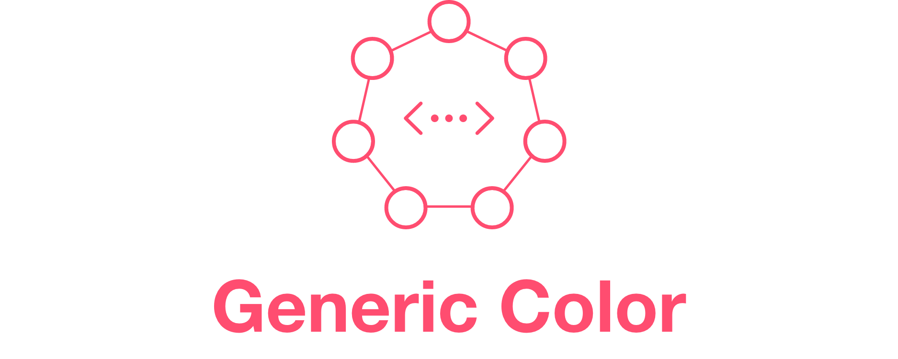

<p align="center">
  
</p>
<p>
    <a href="https://swift.org">
        
    </a>
    <a href="https://swift.org/package-manager">
        
    </a>
    
    <a href="https://twitter.com/maximkrouk">
        
    </a>
</p>


Platform agnostic color Library.

## Usage

```swift
import GenericColor
```

#### Initialization

```swift
// Initialize with byte value via .byte(_) method
let color1 = Color<RGB>(
  red: .byte(221),
  green: .byte(51),
  blue: .byte(12),
  alpha: .byte(255)
)

// or directly via numeric literals and .raw(_) method for numerics
let alpha = 1
let color2 = Color<RGB>(
  red: .max, 
  green: 0.2, 
  blue: .byte(12),
  alpha: .raw(alpha)
)

print(color1 == color2) // true

// hex initialization is supported for RGB color space
// - works with "#" prefix and without, case-insensitive
// - works with rgb, rgba, rrggbb, rrggbbaa representations
// - avalible trough .hex and .init(hex:)
Color.hex("FA6878") // Type == Color<RGB>?
Color(hex: "#aaaf") // rgba, the same as #AAAAAAFF

// or use hex literals
Color(rgb: 0xfa6878)
Color(rgba: 0xfa6878ff)
Color.rgb(0xAAAAAA)

// you can also get an rgb hex value of any color
color1.hex()
color2.hex(uppercased: true)
color3.hex(hashTagPrefix: true)

// color literals will work too, but accuracy is not guarantied
let literal: Color<RGB> = #colorLiteral(red: 0.9803921568627451, green: 0.40784313725490196, blue: 0.47058823529411764, alpha: 1)
```

#### ColorSpaces

```swift
let color1 = Color<RGB>()
let color2 = Color<HSB>()
let color3 = Color<CMYK>()

// Implicit convertions
print(color1.convert() == color2)
print(color1.convert() == color3)
print(color2.convert() == color1)

// Explicit convertions
print(color1.convert(to: HSB.self) == color2)
print(color1.convert(to: CMYK.self) == color3)
print(color2.convert(to: RGB.self) == color1)

// Container mappings
print(color2.map(to: \.cmyk) == color3)
print(color3.map(to: \.rgb) == color1)
print(color3.map(to: \.hsb) == color2)

// Color flat mappings
print(color1.flatMap { $0.with(alpha: 1) })
```

## Installation

Add the package to Your SwiftPM package dependencies:

```swift
.package(
  name: "swift-generic-color",
  url: "https://github.com/capturecontext/swift-generic-color.git",
  .upToNextMinor(from: "0.5.0")
)
```

then add `GenericColor` dependency to your target

```swift
.product(
  name: "GenericColor",
  package: "GenericColor"
)
```


## More

See tests for more usage examples.

Check out higher-level framework [Palette](https://github.com/capturecontext/palette) for more.
